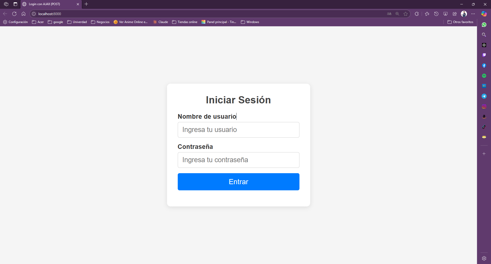
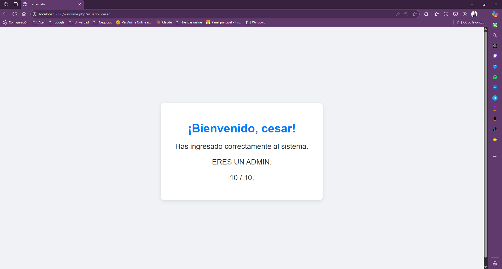

# Proyecto: Login con AJAX (PHP y Fetch API)

Este proyecto demuestra cómo implementar un formulario de inicio de sesión que solicita nombre de usuario y contraseña, envía los datos al servidor utilizando AJAX (Fetch API con método POST) y, tras la validación en PHP, redirige al usuario a una página de bienvenida sin recargar por completo la interfaz. Es ideal para quienes desean entender la comunicación asíncrona entre frontend y backend en aplicaciones web sencillas.

## 🚀 Requisitos Previos

- Sistema operativo: Windows, Linux o macOS
- PHP instalado y configurado en tu sistema

## 🧩 Instalación de PHP

1. Ve al sitio oficial de PHP: [https://www.php.net/downloads](https://www.php.net/downloads)
2. Descarga la versión adecuada para tu sistema operativo.
3. Descomprime el archivo en una ubicación como: `C:\php` (Windows) o `/usr/local/php` (Linux/macOS).

## ⚙️ Configuración de variables de entorno (Windows)

1. Abre el **Panel de Control** → **Sistema** → **Configuración avanzada del sistema**.
2. Haz clic en **Variables de entorno**.
3. En **Variables del sistema**, selecciona `Path` y haz clic en **Editar**.
4. Agrega la ruta donde instalaste PHP, por ejemplo:  
```

C:\php

```
5. Acepta todos los cambios y cierra las ventanas.

6. Verifica la instalación abriendo una terminal (CMD o PowerShell) y ejecutando:
```

php -v

```

Deberías ver la versión de PHP instalada.

## 📁 Estructura del proyecto y propósito de cada archivo.

```
ajax_login/
│
├── index.html     ← Página principal con el formulario de inicio de sesión y estilos básicos.
├── script.js      ← Código JavaScript que captura los datos del formulario y envía la petición AJAX.
├── procesar.php   ← Script PHP que recibe los datos vía POST, valida credenciales y devuelve JSON.
└── welcome.php    ← Página de bienvenida que muestra el nombre del usuario tras el login exitoso.
```

* **index.html**
  Contiene el formulario de login (campos “usuario” y “password”), los estilos CSS (inline) para conseguir una interfaz moderna y profesional, y la referencia a `script.js`.

* **script.js**
  Maneja el evento de envío del formulario (`submit`), captura los valores ingresados, envía la petición AJAX con Fetch API (método POST) a `procesar.php`, procesa la respuesta en JSON y redirige al usuario a `welcome.php` si las credenciales son correctas, o muestra un mensaje de error en pantalla si no lo son.

* **procesar.php**
  Recibe los valores `usuario` y `password` a través de `$_POST`, realiza una validación (en este ejemplo, se comprueba contra credenciales fijas: “cesar”/“123456” o “admin”/“1234”)   y devuelve un objeto JSON con la clave `success` (booleano) y, en caso exitoso, `usuario` (para pasarlo a la página de bienvenida), o en caso de error, `message` (texto explicativo).

* **welcome.php**
  Lee el parámetro `usuario` que llega por GET (por ejemplo, `welcome.php?usuario=admin`), lo sanitiza con `htmlspecialchars` y muestra un mensaje de bienvenida personalizado. Incluye estilos CSS inline similares a los de `index.html` para mantener la coherencia visual.

---

## 📸 Capturas de pantalla

1. **Formulario de inicio de sesión**  

   

2. **Pantalla de bienvenida**  
   

---
  
## ▶️ Cómo Ejecutar el Proyecto

1. Abre la terminal o consola de comandos.

2. Navega a la carpeta donde está tu proyecto, por ejemplo:

   ```bash
   cd ruta/a/ajax_practica_php
   ```

3. Inicia el servidor local con dentro del proyecton en la terminal de VS code:

   ```bash
   php -S localhost:8000
   ```

4. Abre tu navegador y visita:

   ```
   http://localhost:8000
   ```

¡Listo! Verás tu proyecto PHP ejecutándose correctamente.
